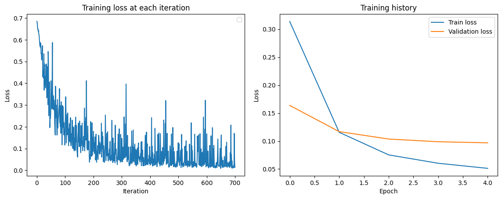
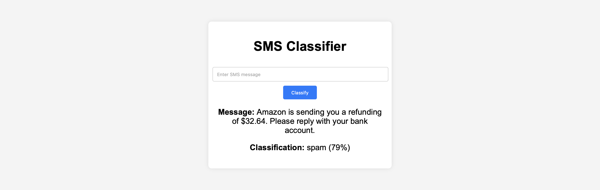

# SMS Spam Classifier

This project is a web application that classifies SMS messages as "spam" or "ham" (legitimate). It involves training a machine learning model to distinguish between spam and non-spam messages, integrating the trained model with a Django REST Framework API for real-time predictions, and providing a simple frontend for user interaction.

## Table of Contents
- [SMS Spam Classifier](#sms-spam-classifier)
  - [Table of Contents](#table-of-contents)
  - [Features](#features)
  - [Prerequisites](#prerequisites)
  - [Installation](#installation)
  - [Usage](#usage)
  - [Model Training and Evaluation](#model-training-and-evaluation)
    - [Training Results](#training-results)
    - [Evaluation Results](#evaluation-results)
  - [API Integration](#api-integration)
    - [Example API Request](#example-api-request)
    - [Example Response](#example-response)
  - [Frontend](#frontend)

## Features
- **Data Preprocessing**: The project includes steps for cleaning and preprocessing the dataset (`spam.csv`) to extract relevant features from the text.
  - The cleaning process involves removing punctuation, stop words, and other noise from the text data.
  - Stemming is applied to reduce words to their root form for better generalization.
- **Model Training**: A `DistilBERT` model is trained on the dataset to classify SMS messages.
- **Model Evaluation**: The model is evaluated using 3-fold cross-validation on the training data regarding accuracy, precision, recall, and F1 score.
- **API Integration**: The trained model is served using `Django REST` Framework, which provides an endpoint for real-time predictions.
- **Frontend Interface**: A simple form-based interface allows users to input SMS messages and view classification results.
- **Error Handling**: Handles invalid inputs (e.g., empty string) gracefully with appropriate error messages.

## Prerequisites
- `Python 3.8` or higher
- `pip` (Python package manager)
- `virtualenv` (optional but recommended for creating a virtual environment)
- `Jupyter Notebook` (for training the model and viewing the evaluation results)

## Installation
1. **Clone the Repository**:
   ```bash
   git clone https://github.com/yourusername/sms-spam-classifier.git
   cd sms-spam-classifier
   ```

2. **Set Up the Python Environment** (optional):
   ```bash
   python3 -m venv venv
   source venv/bin/activate  # On Windows, use `venv\Scripts\activate`
   ```

3. **Install the Required Packages**:
   ```bash
   pip install -r requirements.txt
   ```

## Usage
1. **Model Training and Evaluation** (optional):
   - Open `task.ipynb` in a Jupyter environment to train the `DistilBERT` model on the `spam.csv` dataset.
   - This script handles data preprocessing, model training, and evaluation.
   - The trained model weights will be saved as `model_weights.pth` in the `model/` directory.

2. **Start the Django Server**:
   ```bash
   cd app
   python manage.py runserver
   ```

3. **Frontend**:
   - Visit `http://localhost:8000/` to access the frontend.
   - Input an SMS message, and the result will be displayed after calling the API.

4. **Access the API Endpoint**:
   - The `/api/predict/` endpoint accepts POST requests with a JSON payload:
     ```json
     {
       "sms": "Your message text here"
     }
     ```
   - The response will include the classification result (`spam` or `ham`) and the confidence probability.

## Model Training and Evaluation
The model is trained using the `DistilBERT` architecture, which is a lightweight version of the `BERT` model. The training history is shown in [`task.ipynb`](task.ipynb), along with the evaluation metrics for each fold of the cross-validation.

### Training Results


### Evaluation Results
| Fold | Accuracy | Precision | Recall | F1 Score |
|------|----------|-----------|--------|----------|
| 1    | 0.98     | 0.95      | 0.90   | 0.93     |
| 2    | 0.98     | 0.94      | 0.89   | 0.91     |
| 3    | 0.98     | 0.96      | 0.86   | 0.91     |
| Avg. | 0.98     | 0.95      | 0.88   | 0.92     |

Note that the precision and recall are calculated for the `spam` class.

## API Integration
The trained model is integrated into a Django REST Framework API:

- The API exposes a `/predict/` endpoint to classify SMS messages.
- The endpoint accepts POST requests with an SMS message and returns the classification result along with the confidence level.

### Example API Request
```bash
curl -X POST http://localhost:8000/api/predict/ \
-H "Content-Type: application/json" \
-d '{"sms": "Amazon is sending you a refunding of $32.64. Please reply with your bank account."}'
```

### Example Response
```json
{
  "sms": "Amazon is sending you a refunding of $32.64. Please reply with your bank account.",
  "classification": "spam",
  "probability": 79
}
```

## Frontend
The project includes a simple frontend interface for user interaction:

- Takes user input for an SMS message.
- Sends the input to the API endpoint via a POST request.
- Displays the classification result ("spam" or "ham") and the confidence probability.

